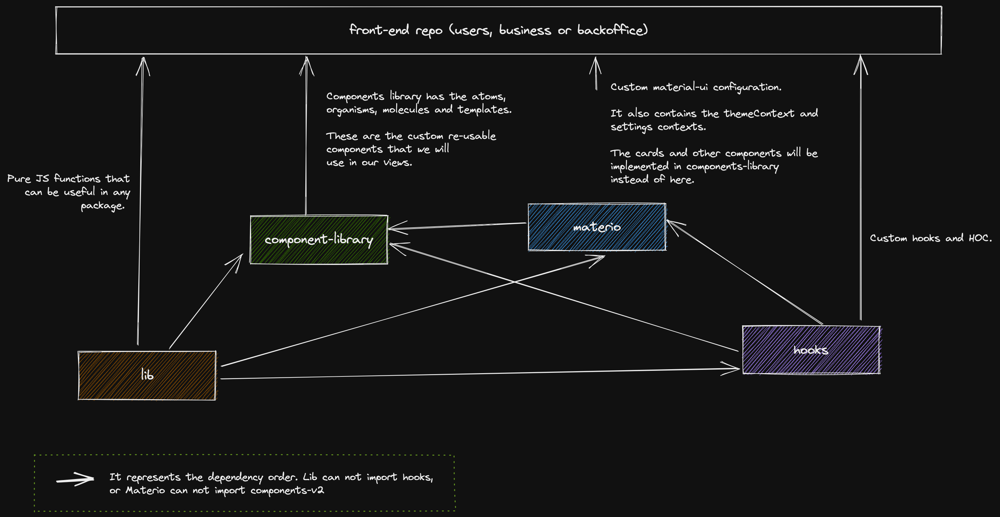

# Nuwe multipackage monorepo

## Project strcuture



## Test the packages in other repos

```bash
# Inside the root directory of the package you use
npm link

## Inside the root directory project you want to use the package
npm link <name>

## Once finnished testing to unlink
npm unlink <name>
```

## Using conventional commits

> The commits and pulls should be done from the root folder

This project uses the [Conventional Commits format](https://www.conventionalcommits.org/en/v1.0.0/#summary) for all changes to the source repository. If you submit a PR, the CI build won't pass until all commits satisfy the format. This format embeds semantic information in each commit that's used to automatically generate release notes.

The Conventional Commits format is as follows:

```bash
<type>([optional scope]): <description>

[optional body]

[optional footer(s)]
```

### Types

Only certain types are permitted, with the most common being:

- fix: a commit that fixes a bug.
- feat: a commit that adds new functionality.
- docs: a commit that adds or improves documentation.
- test: a commit that adds unit tests.
- perf: a commit that improves performance, without functional changes.
- chore: a catch-all type for any other commits. For instance, if you're implementing a single feature and it makes - sense to divide the work into multiple commits, you should mark one commit as feat and the rest as chore.

### Scope

The scope optionally provides extra context. If you're fixing a ListView bug, for example, you might use fix(listview). Or if you are working inside the materio folder package you could provide (materio-listview).

One scope with special meaning is reg, short for regression. This is used for fixes for bugs that weren't present in the most recent stable release.

### Breaking changes

Breaking changes are indicated by putting BREAKING CHANGE: at the start of the message body, for any commit type. Optionally they may be emphasized by appending a ! after the type and scope. The message body should provide appropriate guidance for developers affected by the breaking change.

### Fixing up commits

If you already made commits and they don't meet the Conventional Commits specification, you have a couple of options:

- if there's only one commit to redo, the easiest option is to use git *commit --amend with* no staged changes, which will allow you to edit the commit message.
- if you have multiple commits to reformat, you'll probably need to do an interactive rebase and use the reword option.

## Usefull links

- [Lerna version and publish](https://lerna.js.org/docs/features/version-and-publish)
- [Commit lint](https://github.com/conventional-changelog/commitlint)
- [Commits and versioning](https://levelup.gitconnected.com/improve-your-commits-and-versioning-in-javascript-56f72c0ab761)
- [Storybook with nextjs](https://itnext.io/nextjs-storybookjs-material-ui-jest-swr-fe2ff5cb9af8)
- [Locally test packages with npm](https://javascript.plainenglish.io/test-your-library-locally-with-npm-link-a5aa79d07270)
